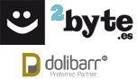

# 2FACTURAE FOR <a href="https://www.dolibarr.org">DOLIBARR ERP CRM</a>

## About
This module has been developed and distributed by 2byte.es Soluciones Informáticas <a href="http://www.2byte.es"> www.2byte.es </a> (Dolibarr Preferred Partner)

Other modules developed by 2byte.es are available on their <a target="_blank" href="https://shop.2byte.es/">official store</a>

You have available guides and videos of our <a target="_blank" href="https://liveagent.2byte.es/853598-M%C3%B3dulos-Oficiales-Externos-Dolibarr">external modules</a>

## Terms of Use, Maintenance and Support
<a target="_blank" href="https://shop.2byte.es/content/6-condiciones-de-uso-mantenimiento-y-asistencia-modulos">Terms of use, maintenance and support</a> specific for Dolibarr external modules developed by 2byte.es (with the exception of the DoliPresta module) and which can be purchased directly from 2byte.es, or through shop2byte (2byte online store) or dolistore (Dolibarr online store).

## Features
Return merchandise authorization (RMA) is a part of the process of returning a product to receive a refund, replacement, or repair during the product's warranty period.

Other modules are available on <a href="https://www.dolistore.com" target="_new">Dolistore.com</a>.


Install
-------

### From the ZIP file and GUI interface

- If you get the module in a zip file (like when downloading it from the market place [Dolistore](https://www.dolistore.com)), go into
menu ```Home - Setup - Modules - Deploy external module``` and upload the zip file.


Note: If this screen tell you there is no custom directory, check your setup is correct: 

- In your Dolibarr installation directory, edit the ```htdocs/conf/conf.php``` file and check that following lines are not commented:

    ```php
    //$dolibarr_main_url_root_alt ...
    //$dolibarr_main_document_root_alt ...
    ```

- Uncomment them if necessary (delete the leading ```//```) and assign a sensible value according to your Dolibarr installation

    For example :

    - UNIX:
        ```php
        $dolibarr_main_url_root_alt = '/custom';
        $dolibarr_main_document_root_alt = '/var/www/Dolibarr/htdocs/custom';
        ```

    - Windows:
        ```php
        $dolibarr_main_url_root_alt = '/custom';
        $dolibarr_main_document_root_alt = 'C:/My Web Sites/Dolibarr/htdocs/custom';
        ```
        

### <a name="final_steps"></a>Final steps

>From your browser:

  - Log into Dolibarr as a super-administrator
  - Go to "Setup" -> "Modules"
  - You should now be able to find and enable the module

Licenses
--------

### Main code


GPLv3 or (at your option) any later version.

See [COPYING](COPYING) for more information.

#### Documentation

All texts and readmes.

